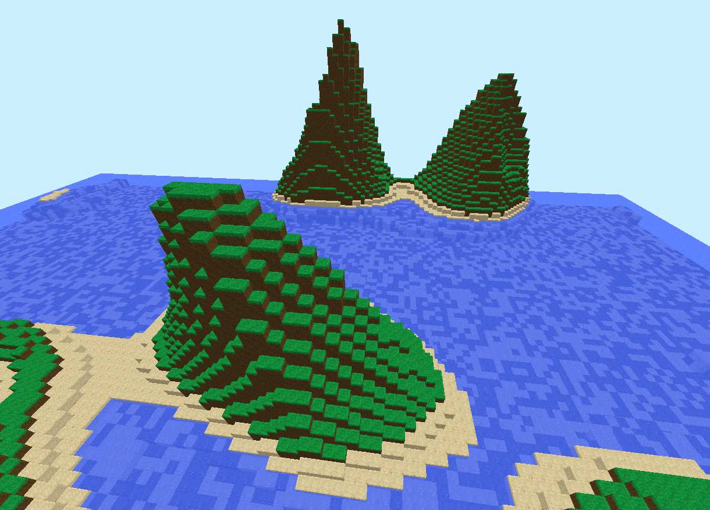

# voxel-game
A simple voxel game written in Java.

## Requirements
* Java 11+
* Git

## Clone, Compile, and Run the Project

### Linux / macOS Systems
1. `git clone https://github.com/SnkSynthesis/voxel-game`
2. `cd voxel-game`
3. `chmod +x mvnw `
4. `./mvnw compile exec:java`
5. Create a JAR (optional)
    1. `./mvnw package`
    2. `java -jar ./target/voxel-game-1.0.jar`

### Windows Systems
1. `git clone https://github.com/SnkSynthesis/voxel-game`
2. `cd voxel-game`
3. `mvnw compile exec:java`
4. Create a JAR (optional)
    1. `mvnw package`
    2. `java -jar ./target/voxel-game-1.0.jar`

## Screenshots

View Screenshots

  
N/A
  

## Controls

* `[W]`, `[A]`, `[S]`, `[D]` - Move around
* `[Move Mouse]` - Look around
* `[Q]` - Lock mouse to window
* `[ESC]` - Unlock mouse from window
* `[Left Shift]` - Move down
* `[Left Control]` - Sprint (increase in movement speed)
* `[Space]` - Move up 
* `[T]` - Toggle wireframe view
